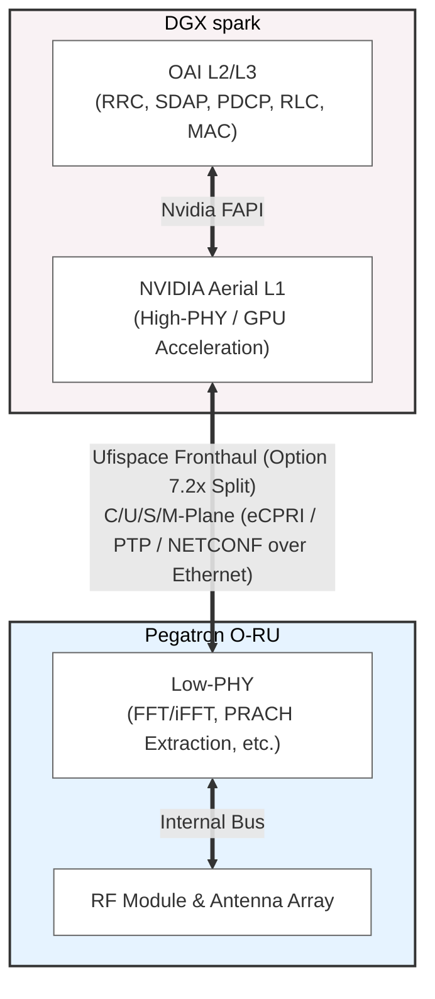

<h1 align="center">Installation Guide - Aerial RAN & Pegatron RU Integration</h1>
<hr>

<div style="background-color: #f8d7da; color: #721c24; padding: 15px; border-left: 5px solid #f5c6cb; margin-bottom: 15px;">
  <strong>🚨 CAUTION:</strong> Make this document <strong>private</strong> by default. Only make it public after publishing the paper of this project.<br><br>
  Request access with the GitHub admin in our group.
</div>

---
<div style="background-color: #cce5ff; color: #004085; padding: 15px; border-left: 5px solid #b8daff; margin-bottom: 15px;">
  <strong>ℹ️ NOTE: Purpose of Installation, Integration, and User Guide</strong><br><br>
  <ul>
    <li><strong>Installation Guide</strong>: Focuses on setup, configuration, and getting the system running.</li>
    <li><strong>User Guide</strong>: Focuses on how to <strong>use</strong> the system once it's installed and running.</li>
    <li><strong>Project Documentation</strong>: Define <code>System Architecture</code> & attach the installation guide link, <code>use case diagram</code>, <code>message-sequence chart (MSC)</code>, <code>class diagram</code>, <code>flowchart</code>.</li>
  </ul>
</div>

Correlation between Installation, User Guides, and Project documentation:



## Table of Contents

<div style="background-color: #d4edda; color: #155724; padding: 15px; border-left: 5px solid #c3e6cb; margin-bottom: 15px;">
  <strong>💡 TIP:</strong> Generate the Table of Contents automatically using <a href="https://marketplace.visualstudio.com/items?itemName=yzhang.markdown-all-in-one#table-of-contents">Markdown All in One extension in VS Code</a>.
</div>

- [Table of Contents](#table-of-contents)
- [Project description](#project-description)
- [Pre-Integration Checklist](#pre-integration-checklist)
- [Execution Status](#execution-status)
- [System Architecture](#system-architecture)
- [Repository Structure](#repository-structure)
  - [Configuration](#configuration)
  - [Installation Steps](#installation-steps)
- [Post-Installation Verification](#post-installation-verification)
- [Troubleshooting](#troubleshooting)
- [References](#references)

## Project description

**Project Name:** Aerial RAN + Pegatron RU Integration

**Description:** A comprehensive guide for integrating NVIDIA Aerial RAN with the Pegatron Radio Unit (RU) via the Fronthaul interface. 

**Key Features:**
- Establish physical connectivity and Fronthaul networking (C3).
- Configure Precision Time Protocol (PTP) synchronization.
- Align Aerial L1 configurations with RU specifications.

**Target Users:** Developers / System Administrators

## Pre-Integration Checklist

<div style="background-color: #fff3cd; color: #856404; padding: 15px; border-left: 5px solid #ffeeba; margin-bottom: 15px;">
  <strong>⚠️ IMPORTANT:</strong> The integration process has not yet started. The following checklist outlines the critical steps and considerations required to successfully integrate Aerial RAN with the Pegatron RU.
</div>

- [ ] **Multiplexed Fronthaul Port:** Note that the Pegatron RU multiplexes all planes (C/U/S/M/SSH) on a single physical fiber port, differentiating them by VLAN IDs.
- [ ] **Hardware Connection:** Complete the physical wiring of the hardware equipment (DGX) to the Fronthaul to realize C3 connectivity.
- [ ] **Network IP & VLAN Planning:** Define the specific IPs, VLANs, and NIC names for the DU host environment. 
  - *Caution 1:* Ensure the host IP does **not** conflict with the Pegatron RU's IP address.
  - *Caution 2:* It is highly recommended to allocate **new, isolated VLAN IDs** (e.g., VLAN `1028`, `103`, `104`) rather than reusing old VLANs (e.g., from legacy JURA setups) to prevent potential throughput drops and conflicts.
- [ ] **MAC Address Validation:** Obtain the MAC address of the Pegatron RU. These parameters must be updated in the OAI or Aerial configuration files.
- [ ] **PTP Synchronization (S-Plane):** Ensure that PTP services (`ptp4l`, `phc2sys`) are correctly running and synchronized.
  - *Verification:* The `phc2sys` status should show an `offset` within **±100**, and the `ptp4l` status should show an `rms` within **±100**.
- [ ] **Timing Window:** **(Critical Blind Spot)** The Timing Window parameters for the Pegatron RU differ from older models. It is imperative to acquire the exact correct values so that the NVIDIA Aerial L1 can successfully communicate with the RU.(Modify in Aerial L1)
- [ ] **DPDK & Fronthaul Script Adaptation:** A typical script (like `oaipega.sh`) is used for DPDK VF setup, CPU power profiles, and MTU settings. *Note:* Because we are using Aerial RAN, the network optimization script may differ from standard OAI setups. Ensure it perfectly matches the Aerial L1 DPDK requirements.(Modify in Aerial L1)
- [ ] **NETCONF / Netopeer2 Configurations:** Prepare the required XML files (`ietf-interface-processing-element.xml` and `o-ran-uplane-conf_...xml`) to configure the RU via its M-plane.

## Access Method (if any)

<div style="background-color: #cce5ff; color: #004085; padding: 15px; border-left: 5px solid #b8daff; margin-bottom: 15px;">
  <strong>ℹ️ NOTE:</strong> Our servers are put in the server room. Please contact the admin for VPN access.
</div>

```shell
Host: <IP address>
User: <username>
```

## Execution Status

<div style="background-color: #cce5ff; color: #004085; padding: 15px; border-left: 5px solid #b8daff; margin-bottom: 15px;">
  <strong>ℹ️ NOTE: Status Icons:</strong><br>
  <ul>
    <li>✅ Completed successfully</li>
    <li>⏳ In progress / Pending</li>
    <li>❌ Error / Failed (with explanation)</li>
  </ul>
</div>

| Step                                                                  | Status | Timeline    | Execution Status / Notes                                     |
| --------------------------------------------------------------------- | ------ | ----------- | ------------------------------------------------------------ |
| Physical Hardware Connection                                          | ⏳      | TBD         | Pending wiring setup                                         |
| PTP Synchronization Setup                                             | ⏳      | TBD         | Pending validation of `ptp4l`/`phc2sys`                      |
| Timing Window & Config Verification                                   | ⏳      | TBD         | Need to obtain exact parameters for Pegatron RU              |
| DPDK & Fronthaul Environment Check                                    | ⏳      | TBD         |                                                              |
| L1 & OAI Integration Testing                                          | ⏳      | TBD         |                                                              |

## System Architecture

<div style="background-color: #cce5ff; color: #004085; padding: 15px; border-left: 5px solid #b8daff; margin-bottom: 15px;">
  <strong>ℹ️ NOTE: Draw.io Files Management:</strong><br><br>
  If you create system architecture diagrams using draw.io:<br>
  <ul>
    <li>Store the raw <code>.drawio</code> files in the <code>./docs/drawio</code> folder of your repository</li>
    <li>Export diagrams as PNG/SVG and embed them in the documentation</li>
    <li>Keep <code>draw.io</code> files versioned for easy updates and maintenance</li>
    <li>Use consistent naming: <code>&lt;project-name&gt;.drawio</code></li>
  </ul>
</div>

**Important Components to Include in System Architecture:**

1. **IP Addresses** - Specify IP address for each module/component
2. **Connection Types** - Clear indication of connection types (WiFi, RJ-45, etc. ) & protocols (HTTP, TCP, UDP, WebSocket, etc.)
3. **Sub-module Structure** - Show internal components and their relationships
4. **Data Flow Direction** - Indicate request/response patterns
5. **Port Numbers** - Specify communication ports.
6. **Network Boundaries** - Show different network segments (DMZ, internal, external)

*(Architecture details to be added)*

## Repository Structure

*(To be filled during integration)*

### Configuration

*(To be filled during integration)*

### Installation Steps

<div style="background-color: #cce5ff; color: #004085; padding: 15px; border-left: 5px solid #b8daff; margin-bottom: 15px;">
  <strong>ℹ️ NOTE:</strong> The following steps outline the generalized integration flow. Actual IP addresses, VLAN IDs, and NIC names will vary depending on your DGX Spark environment.
</div>

#### **Phase 1: Initial Network Setup & RU Access**
Because the Pegatron RU multiplexes all planes on a single port, you must first configure the Distributed Unit (DU) host network to communicate with the RU's default and Management (M-plane) interfaces.

1. **Configure DU Host Interfaces:**
   Set up the base IP for initial access and a VLAN sub-interface for the M-plane (e.g., VLAN 4).
   > *Note: Substitute `ens1f0` with your actual NIC name, and ensure the IPs do not conflict with the RU.*
   ```bash
   sudo ip addr add <DU_Base_IP>/24 dev ens1f0
   sudo ip link add link ens1f0 name ens1f0.4 type vlan id 4
   sudo ip addr add <DU_MPlane_IP>/24 dev ens1f0.4
   sudo ip link set ens1f0.4 up
   ```

2. **Access the Pegatron RU:**
   SSH into the RU using its default IP.
   ```bash
   ssh padmin@<RU_Default_IP>  # Password: Pega@2025
   ```

3. **Configure RU M-Plane:**
   Inside the RU console, assign a static IP to the M-plane and bind it to the correct VLAN.
   ```text
   PR1450# c i
   PR1450(config-interface)# ip-setting mplane static <RU_MPlane_IP> 255.255.255.0
   PR1450(config-interface)# mplane-vlan 4
   PR1450(config-interface)# reboot
   ```

#### **Phase 2: RU Configuration via M-Plane (Netopeer2)**
Once the RU reboots, use the NETCONF protocol via `netopeer2-cli` to push the O-RAN specifications for the interface processing elements and user-plane configurations.

1. **Prepare XML Configuration Files:**
   *   `ietf-interface-processing-element.xml`: Defines MAC addresses, VLAN for the `cuplane` (e.g., VLAN 3), and O-DU/RU MAC bindings.
   *   `o-ran-uplane-conf_100M_4x4.xml`: Defines the physical layer parameters (bandwidth, antennas, SCS, PRBs, etc.).

2. **Push Configurations to RU:**
   Connect to the RU's M-plane IP and apply the XML files.
   ```bash
   netopeer2-cli
   > connect --host <RU_MPlane_IP> --port 830 --login padmin  # Password: Pega@2025
   > edit-config --target running --config=ietf-interface-processing-element.xml
   > edit-config --target running --config=o-ran-uplane-conf_100M_4x4.xml
   ```

#### **Phase 3: DU Host Environment Preparation (Aerial RAN)**
Before launching Aerial L1 and the gNB, the host machine's NICs must be optimized for real-time performance and bound to DPDK.

1. **Execute the DPDK & Network Setup Script:**
   You will run a network setup script (similar to standard OAI's `oaipega.sh`, but adapted for Aerial L1 requirements). This script ensures the host environment is correctly optimized before L1 execution. It handles:
   *   Setting CPU power profiles to `realtime`.
   *   Increasing ring buffers to `4096` and setting MTU to `9600` (Jumbo frames).
   *   Creating Virtual Functions (VFs) on the physical NIC (e.g., using `sriov_numvfs` to create `NUM_VFS=2`) with the designated MAC address and U-plane VLAN.
   *   Binding the VFs to the `vfio-pci` driver for DPDK compatibility.
   ```bash
    sh setup_aerial_dpdk.sh # Replace with your actual Aerial DPDK setup script. DO NOT blindly use the standard oaipega.sh.
   ```
   > *Note: Modify the variables (`NIC`, `VF_MAC`, `VF_VLAN`, `VLAN_ID_MGMT`) at the top of the script according to your specific hardware setup.*

#### **Phase 4: Launching Aerial L1 and OAI gNB**
Because we are using NVIDIA Aerial L1 integrated with the OAI gNB, we do not launch the `nr-softmodem` binary directly. Instead, the deployment relies on Docker Compose.

1. **Verify OAI & Aerial Configurations:**
   *   **Aerial L1 Configuration:** Ensure `cuphycontroller_P5G_WNC_DGX.yaml` has the exact Pegatron RU MAC addresses, VLAN parameters, DPDK parameters, and Fronthaul Timing Windows correctly mapped. **Crucial Note:** Aerial L1 parameters MUST be configured in the NVIDIA YAML file. If you attempt to modify L1-specific settings (like Timing Windows or DPDK bindings) inside the OAI VNF config, **they will be completely ignored**.

2. **Start the Integrated Setup:**
   For comprehensive details on launching the containers, refer to the [Aerial OAI Integration Guide](./Aerial_OAI_Integration_Guide.md).
   ```bash
   cd "$OAI_HOME"/ci-scripts/yaml_files/sa_gnb_aerial
   docker compose up -d
   ```

## Post-Installation Verification

*(To be filled during integration)*

## Troubleshooting

### Common Issues and Solutions

1. **DPDK Device Binding Failure**
   *   **Symptom:** Logs show `EAL: Driver cannot attach the device (0000:70:02.0) / Network port doesn't exist`.
   *   **Resolution:** This indicates the DPDK environment isn't properly initialized. Re-run your DPDK network setup script (e.g., `setup_aerial_dpdk.sh`) to ensure VFs are created, the `vfio_pci` module is loaded, and the devices are successfully bound.

2. **Random Segmentation Faults (C3 Structure)**
   *   **Symptom:** The gNB or L1 component crashes with a `SIGSEGV` error (often observed in threads like `fh_rx_bbdev-2` at `xran_process_prach_sym` within the fronthaul library).
   *   **Context:** This has been identified as a stability issue occurring under the C3 topology when processing PRACH symbols in the Fronthaul interface buffer. It requires deeper debugging within the DPDK/Fronthaul RX modules.

## References

<div style="background-color: #cce5ff; color: #004085; padding: 15px; border-left: 5px solid #b8daff; margin-bottom: 15px;">
  <strong>ℹ️ NOTE:</strong> Add external links, datasheets, or internal documentation regarding the Pegatron RU and NVIDIA Aerial integration here.
</div>

- [NTUST BMW Lab: Pegatron RU Notion Documentation](https://www.notion.so/ntust-bmwlab/Pegatron-RU-25e10098314380b7976ffda3f04a13b3)
- [Add your reference link here]

---

<div style="background-color: #cce5ff; color: #004085; padding: 15px; border-left: 5px solid #b8daff; margin-bottom: 15px;">
  <strong>ℹ️ NOTE:</strong> This installation guide is regularly updated. For the latest version, check the <a href="https://github.com/your-username/your-repo">GitHub repository</a>.
</div>
