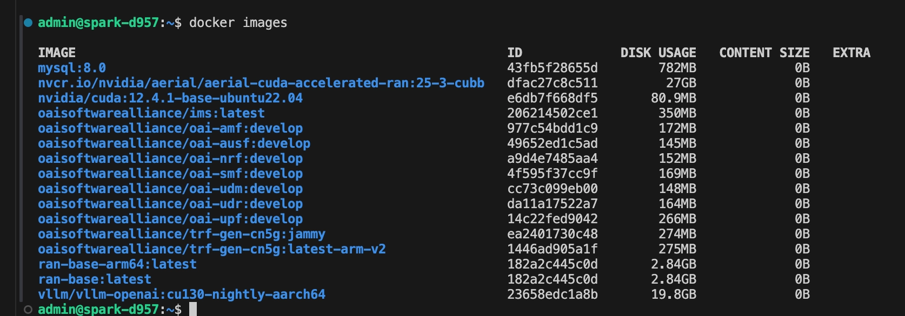
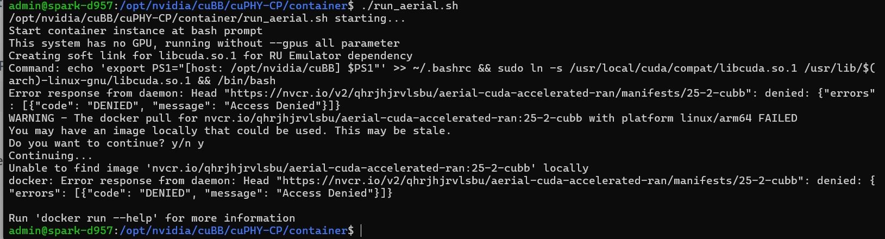
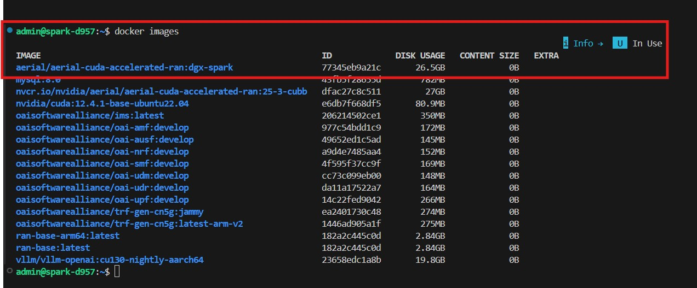
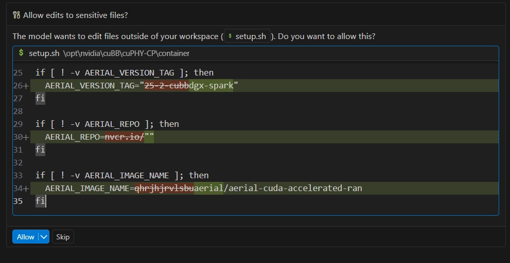
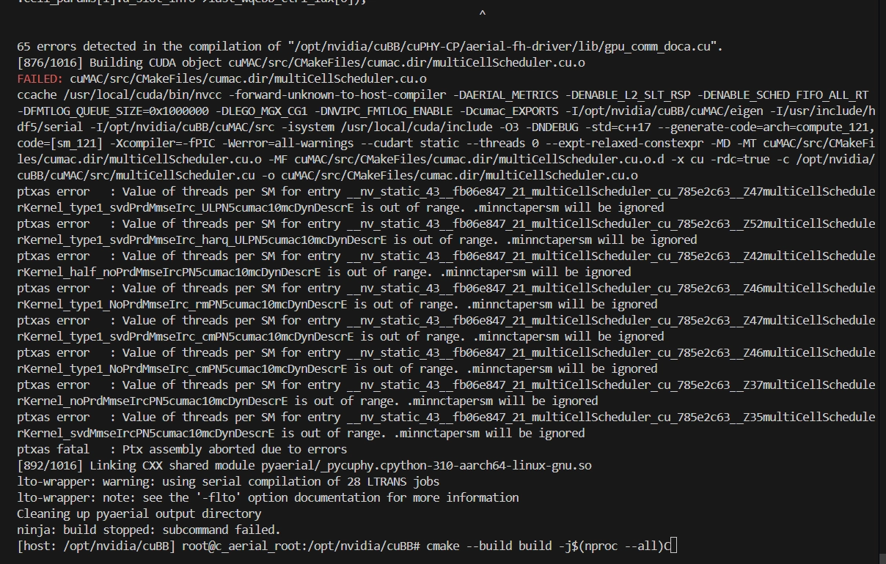

# Container Troubleshooting

This guide addresses common issues encountered when pulling Docker images, running the Aerial container, or handling compilation errors.

## 1. Docker Remote Image Pull Failures

When running the container startup script:
```bash
sudo ./cuPHY-CP/container/run_aerial.sh
```

You might encounter errors pulling from `nvcr.io` (e.g., Access Denied or Timeout):
> `Error response from daemon: Head "https://nvcr.io/v2/...": denied: Access Denied`
> `Error response from daemon: Get "https://nvcr.io/v2/": dial tcp: ... i/o timeout`

This indicates your system lacks authorization to download the image remotely, or network constraints block it.





## 2. Loading Offline Docker Images

If remote pulling fails, you can manually load an exported Docker image tarball (e.g., `aerial-cuda-accelerated-ran_dgx-spark.tar`).

### Step 1: Transfer and Load the Image

Once the `.tar` image is transferred to your system (e.g., via SCP):
```bash
scp aerial-cuda-accelerated-ran_dgx-spark.tar <DGX-spark>:~/Downloads/
```

Use the following command to import the image into your local Docker environment:

```bash
docker load -i ~/Downloads/aerial-cuda-accelerated-ran_dgx-spark.tar
```
*(This may take a while. It will print "Loaded image" when completed.)*

### Step 2: Verify the Loaded Image

Check your local Docker images to find the imported image:

```bash
docker images
```

Look for an image labeled `aerial/aerial-cuda-accelerated-ran` with the tag `dgx-spark`.



### Step 3: Update Container Execution Scripts

You must update the execution scripts to use the loaded local image instead of the remote registry image (`nvcr.io/nvidia/aerial/aerial-cuda-accelerated-ran:25-3-cubb`). In your script or configuration override:

| Variable | Original | Updated |
| :--- | :--- | :--- |
| `AERIAL_REPO` | `nvcr.io/` | `""` (Empty string) |
| `AERIAL_IMAGE_NAME` | `qhrjhjrvlsbu/aerial-cuda-accelerated-ran` | `aerial/aerial-cuda-accelerated-ran` |
| `AERIAL_VERSION_TAG` | `25-2-cubb` | `dgx-spark` |

After making these changes, running `sudo ./cuPHY-CP/container/run_aerial.sh` should execute successfully!



## 3. cuMAC Build Errors (ptxas fatal)

When compiling within the container using `cmake --build build`, you might run into errors:
> `ptxas error : Value of threads per SM for entry ... is out of range`
> `ptxas fatal : Ptx assembly aborted due to errors`




...
